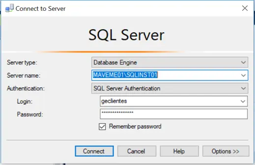
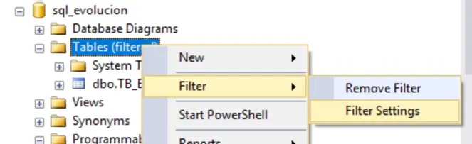
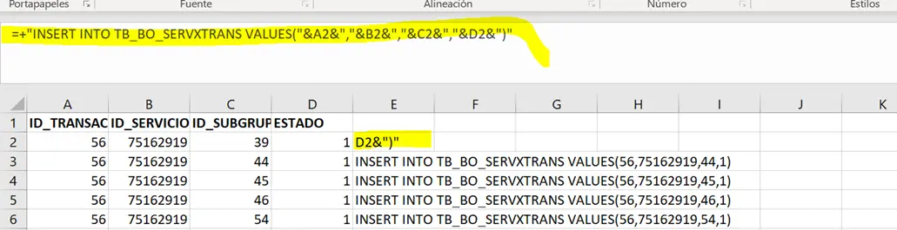
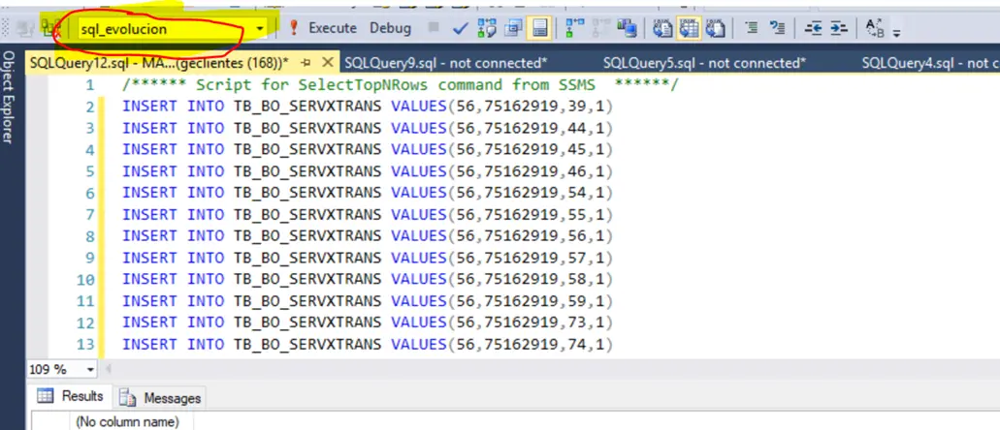

---
title: Procesos de backoffice  
sidebar:
  label: Manejo Backoffice

tableOfContents:
  minHeadingLevel: 2
  maxHeadingLevel: 4
 
prev: false
next: false

--- 
import { Aside } from '@astrojs/starlight/components';
import { Card } from '@astrojs/starlight/components';
import { Steps } from '@astrojs/starlight/components';
import { Tabs, TabItem } from '@astrojs/starlight/components';

### Cargue de ofertas Masivas Backoffice

<Tabs>
   <TabItem label="Rutas">
    <Steps>
      1. Conectarse a la Sql server:
         <div class="flex justify-center w-full">
            <div class="w-3/4 border">
              
            </div>
         </div>
      2. Filtrar con **TB_BO_SERVXTRANS**:
         <div class="flex justify-center w-full">
            <div class="w-3/4 border">
              
            </div>
         </div>
      3. Abrir el excel enviado y pegar la siguiente linea en la casilla **E2** (Arrastrar hasta el final del documento)
         ```js
         =+"INSERT INTO TB_BO_SERVXTRANS VALUES("&A2&","&B2&","&C2&","&D2&")"
         ```
         <div class="flex justify-center w-full">
            <div class="w-3/4 border">
              
            </div>
         </div>
      4. Ejecutar en Sql Server
         <div class="flex justify-center w-full">
            <div class="w-3/4 border">
              
            </div>
         </div>
      5. Responder correo:

         ```js
         Buen día,  

         Confirmo que la asociación de planes masivos fue realizada exitósamente.
         
         Quedo atento a comentarios
         ```          
    </Steps>
   </TabItem>
   <TabItem label="Credenciales">
    Credenciales y Servidor para conectarse a la base de datos:
      <Card>      
      - Servicio: **MAVEME01\SQLINST01**
      - Nombre de Usuario: **SCRIBA**
      - Contraseña: **M0V1star**
      </Card>
   </TabItem>
</Tabs>
