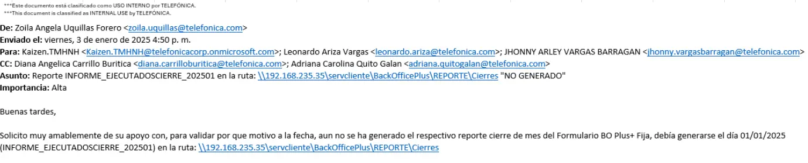
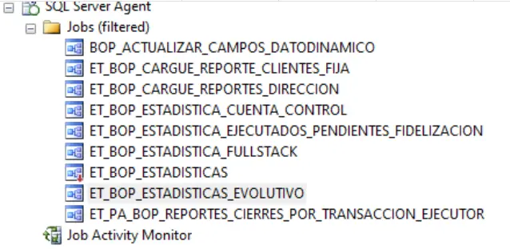
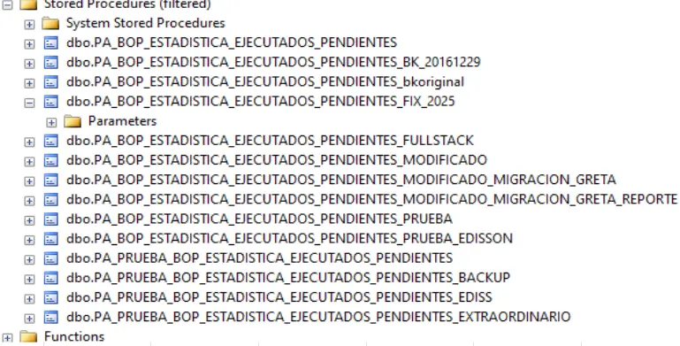
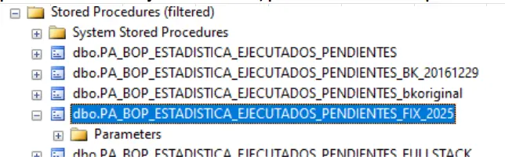
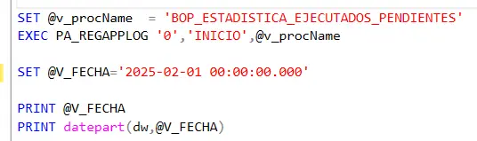

---
title: Reporte Mensual Backofficce Plus 
sidebar:
  label: Reporte Backofficce Plus

tableOfContents:
  minHeadingLevel: 2
  maxHeadingLevel: 4
 
prev: false
next: false

--- 
import { Aside } from '@astrojs/starlight/components';
import { Tabs, TabItem } from '@astrojs/starlight/components';
import { Steps } from '@astrojs/starlight/components';

### Ruta 
 
<Tabs>
  <TabItem label="Reporte">
     El reporte se genera en la siguiente URL : 
      ```bash
      \\192.168.235.35\servcliente\BackOfficePlus\REPORTE\INFORME_EJECUTADOSCIERRE_

      ```
      <div class="flex justify-center w-full gap-4">
        <div class="w-full border">
          
        </div>  
      </div>
  </TabItem>
  <TabItem label="Credenciales">
    <Aside type="caution">
        -  Ver el Excel
    </Aside>
  </TabItem>
</Tabs>  

### Pasos a seguir

<Steps> 
  1. Conectarse a la base de datos.
      - **Instancia Producción**: MAVEME01\\SQLINST01
  2. Existen varios Jobs que ejecutan varios Stored Procedure. 
     <div class="flex justify-center w-full gap-4">
       <div class="w-1/2 border">
         
       </div>  
       <div class="w-1/2 border">
         
       </div>  
     </div>

  3. Se modifica el SP: **PA_BOP_ESTADISTICA_EJECUTADOS_PENDIENTES_FIX_2025**
     - Se debe cambiar fecha al mes actual
      <div class="flex justify-center w-full gap-4">
        <div class="w-1/2 border">
          
        </div>  
        <div class="w-1/2 border">
          
        </div>  
      </div>
  4. Se ejeculta manualmente el Store Procedure 

</Steps> 