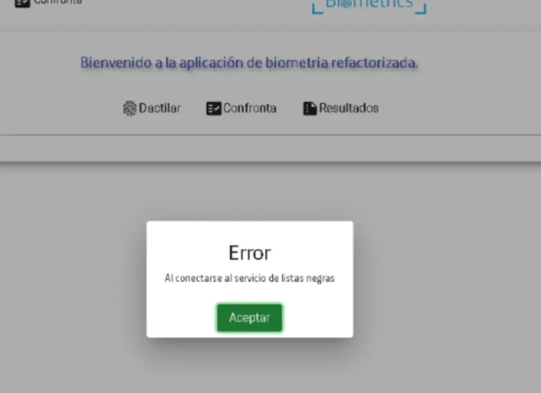

---
title: Casos reportados en el chat  
sidebar:
  label: Casos reportados

tableOfContents:
  minHeadingLevel: 2
  maxHeadingLevel: 4
 
prev: false
next: false

--- 
import { Aside } from '@astrojs/starlight/components';
import { Steps } from '@astrojs/starlight/components';
import { Tabs, TabItem } from '@astrojs/starlight/components'; 

### Toma de huellas

<Steps>
1. **Colocación del Dedo**:
    <p>
      Asegúrate de que el dedo se coloque en el lector de huellas cubriendo la mayor parte de la superficie de la pantalla.
    </p>    
2. **Presión Adecuada**:
    <p>
      Aplica una presión moderada a alta para asegurar una lectura óptima.
    </p>
3. **Tiempo de Contacto**:
    <p>
      Mantén el dedo en el captor unos segundos adicionales hasta que la aplicación inicie el nuevo conteo.
    </p>
4. **Limpieza Regular**:
    <p>
      Limpia el huellero de manera periódica, especialmente por motivos de higiene, en el contexto de medidas preventivas contra COVID-19.
    </p>
5. **Hidratación de los Dedos**:
    <p>
      Si es necesario, humedece ligeramente los dedos del cliente con un producto sin alcohol para mejorar la lectura de la huella.
    </p>
</Steps>

### Vendedor nuevo en Biometría.

Si se solicita la creación de un usuario en Biometría Cloud, se debe validar que el usuario tenga un código de GRETA activo. 
Sino, debe ser creado por el área correspondiente.

**Respuesta al usuario cuando el código existe**: 
```json
Si el usuario cuenta con Código de vendedor de Greta, no requiere creación debido 
a que ya tiene habilitado por defecto el acceso a Biometría Cloud desde CRM 
con su usuario y contraseña. Por favor validar ingreso.   
```   

### No Recepción de Tokens en Correos o Teléfonos

Si los asesores no reciben los tokens, es debido a datos incorrectos.
Si los asesores no reciben los tokens, es debido a datos incorrectos.

**Respuesta al usuario cuando el código existe**: 
```json
Esto es porque los datos no están actualizados. Se debe crear un caso a través de la mesa de ayuda, seleccionando la tipología de fallas OIM.    
Es importante que proporcionen los datos correctos, incluyendo el correo corporativo y el número de celular actualizado.
```    

### No Detección del Software del Captor

Tienes dos opciones para resolver este tema:

<Tabs>
  <TabItem label="Cerrar sesión">Cerrar sesión y volver a ingresar al equipo.</TabItem>
  <TabItem label="Reiniciar servicio">
    <Steps>
      1. Presiona la tecla **Windows** en tu teclado.
      2. Escribe **"Servicios"** en la barra de búsqueda.
      3. Haz clic en la aplicación **"Servicios"** que aparecerá en los resultados.
      4. Dentro de la ventana de Servicios, busca el servicio **".NET device info"** en la lista.
      5. Haz doble clic en **".NET device info"** para abrir sus propiedades.
      6. En las **propiedades** del servicio, selecciona la opción **"Iniciar"** para activar el servicio.
    </Steps> 
  </TabItem>
</Tabs>
 
### Migración de Usuarios a la Biometría ONPREMISE a la Biometría Cloud


<Aside type="caution">
  Recordar que los usuarios que estén en el parámetro, están en ONPREMISE. Por defecto todos están en Biometría Cloud 
</Aside>

Para migrar los usuarios de la Biometría ONPREMISE a la Biometría Cloud, sigue estos pasos:

<Steps>
1. **Conectarse a la Base de Datos de Biometría**: Accede a la base de datos de biometría donde se almacenan los parámetros de configuración.
2. **Consultar los Códigos de los Vendedores**: Realiza la siguiente consulta SQL para obtener los códigos de los vendedores actuales en ONPREMISE:
     ```sql
     SELECT VALOR_PARAMETRO FROM TB_CERO_PAPEL_PARAMETRO WHERE ID_PARAMETRO = 2327;
     ```
3. **Migrar de ONPREMISE a CLOUD**: 
    - Debe **ELIMINAR** los códigos de los usuarios que deseas excluir, dejando los códigos de los usuarios requeridos.
   - Asegúrate de no dejar dos puntos consecutivos (`;;`), ya que esto otorgaría acceso a todos los usuarios. 
    - La consulta para agregar los códigos será
     ```sql
     UPDATE TB_CERO_PAPEL_PARAMETRO SET VALOR_PARAMETRO = 'codigos' WHERE ID_PARAMETRO = 2327;
     ```
4. **Migrar de CLOUD a ONPREMISE**:
   - Debe **AGREGAR** los códigos de los usuarios que deseas incluir, dejando los códigos de los usuarios requeridos.
   - Asegúrate de no dejar dos puntos consecutivos (`;;`), ya que esto otorgaría acceso a todos los usuarios. 
   - La consulta para quitar los códigos será similar a la de agregar, pero con los códigos modificados.
    ```sql
    UPDATE TB_CERO_PAPEL_PARAMETRO SET VALOR_PARAMETRO = 'codigos' WHERE ID_PARAMETRO = 2327;
    ```
5. **Ejecutar la Actualización**:
   - Una vez que hayas agregado o quitado los códigos de los usuarios, ejecuta la consulta `UPDATE` para actualizar la base de datos con los nuevos valores.
     ```sql
     UPDATE TB_CERO_PAPEL_PARAMETRO SET VALOR_PARAMETRO = 'codigos_actualizados' WHERE ID_PARAMETRO = 2327;
     ```
</Steps>

### Error de Listas Negras  
Si aparece un error en el proceso de listas negras:

<div class="flex justify-center w-full">
  <div class="w-3/4">
    
  </div>
</div>

**Respuesta al usuario cuando el código existe**: 
```json
Este error se debe a que la validación de listas negras está recibiendo un dato está en blanco. 
Para solucionar, se debe cerrar la ventana de biometria y volver a ingresar desde el CRM, de esa manera se cargará la data correctamente. 
Además recordar que se debe tener solo una página de biometria abierta. 
```   

### Cambio de Fecha de Expedición de la Cédula

Para modificar la fecha de expedición de la cédula, es necesario **cancelar la transacción actual** en el sistema de biometría. 

Para ello, haz clic en la **esquina superior izquierda**. Luego, vuelve a ingresar al sistema para reiniciar el proceso desde el formulario inicial.

### Excepciones: Cliente sin Forma de Recibir Tokens
Si el cliente **no tiene acceso** a su celular se debe registrar su correo electrónico. 

En lugar del número de celular del cliente, se debe ingresar el **número del coordinador o responsable del centro de experiencia**.

### Ingreso al Proceso de Excepción
Para iniciarl el proceso de excepción, en la **esquina superior izquierda**, se encuentra el logo de Movistar. Haz clic en este ícono.

En la nueva ventana selecciona el flujo de **Confronta** o **Excepción** para continuar con el proceso.

### Problemas con Aplicativos de Biometría
Los **responsables o los analistas** deben generar un caso a través de **Frida**:

- Seleccionando la opción **Equipos de Cómputo** 
- Luego **Fallas de Equipos y Periféricos**
- Esto permitirá que alguien de la mesa de soporte los contacte para validar y solucionar el problema.

### No se Puede Obtener la MAC

<Tabs>
  <TabItem label="DIFERENTE a Citrix">
     Si no se detecta la MAC del equipo en un entorno **DIFERENTE a Citrix**, sigue los siguientes pasos:
     <Steps>
       1. **Cerrar sesión y volver a ingresar al equipo**.
       2. **Si el problema persiste**: Es probable que sea un **problema del equipo**. En este caso, se debe generar un caso a través de **Frida**:
          - Seleccionando la opción **Equipos de Cómputo** 
          - Luego **Fallas de Equipos y Periféricos**
          - Esto permitirá que alguien de la mesa de soporte los contacte para validar y solucionar el problema.
     </Steps>
  </TabItem>
  <TabItem label="Citrix">
     Si no se detecta la MAC del equipo en un entorno **Citrix**, sigue los siguientes pasos:
     <Steps>
       1. **Reiniciar el escritorio virtual**: En el equipo, debes reiniciar el escritorio virtual como primera opción. (**Si no funciona, pasar al paso 5 si se desea agilizar**)
       2. **Acceder al archivo de la MAC**: 
          - Abre una carpeta en Citrix.
          - En la barra de direcciones, escribe: C:\Captura.
          - Busca el archivo mac.txt
          - Este archivo debe contener información en el siguiente formato:           
            **usuario de red; fecha; mac; ip**.
       3. **Si el archivo mac.txt no está completo**:
            - Reinicia el escritorio virtual.
            - Reinicia el thin client.
       4. **Pantallas negras al iniciar**: Al reiniciar, aparecerán dos pantallas negras que no debes cerrar manualmente. Estas se cerrarán automáticamente una vez que el archivo mac.txt se haya llenado correctamente.
       5. **Si el problema persiste**: Es probable que sea un **problema del equipo**. En este caso, se debe generar un caso a través de **Frida**:
          - Seleccionando la opción **Equipos de Cómputo** 
          - Luego **Fallas de Equipos y Periféricos**
          - Esto permitirá que alguien de la mesa de soporte los contacte para validar y solucionar el problema.
       </Steps>
  </TabItem>
</Tabs>

### Falla en Proceso de migración (Migrate)

Si se encuentra una falla en el **proceso de migración** donde la validación es exitosa pero al intentar continuar en Greta no es posible. 
Error: "Falló la validación"

<div class="flex justify-center w-full gap-4">
  <div class="w-1/2 border">
    
  </div> 
  <div class="w-1/2 border">
    
  </div>
</div>

Se deben seguir estos pasos:

<Steps>
1. **Verificar los Datos de Entrada**: 
    - Asegúrate de que el número de cédula, nombres y tiempos de confronta estén correctamente actualizados.
    - El tiempo para confronta debe ser de **30 minutos** y para huellas de **60 minutos**.
2. **Consumir el Servicio de Migración**:
    - Realiza una solicitud POST al siguiente servicio de migración: 
      ```
      https://biometrics.telefonica.co/bio-wab-migrate/Migrate
      ```
    - En el cuerpo de la solicitud POST, incluye los siguientes parámetros:
      ```json
      {
        "docNumber": "123456",
        "lastName": "Perez",
        "name": "Pablo",
        "idType": "1",
        "Nut": "7k7qugyz8fki",
        "userName": "jeosorioal",
        "minutes": 30,
        "apikey": "b+fEQF+k9kSUnALTGFphiA=="
      }
     ```
3. **Actualizar la Información**:
    - Actualiza el número de cédula, los nombres del cliente y el tiempo de confronta.
    - El tiempo para confronta debe ser de **30 minutos** y para huellas de **60 minutos**.
4. **Respuesta del Servicio**:
   - La respuesta del servicio será la siguiente:
     ```json
     {
         "Error": 0,
         "Message": "Exito",
         "Values": ""
     }
     ```
   - Si recibes esta respuesta, significa que el servicio se ha ejecutado correctamente.
5. **Verificar el Resultado**: Después de consumir el servicio, prueba nuevamente en Greta para comprobar si ahora puedes continuar con el proceso.
</Steps>


### Reporte de Error Bloqueo por Gateway

Si se reporta el error relacionado con el bloqueo del gateway debido a la encriptación del CRM, sigue estos pasos:

<div class="flex justify-center w-full">
  <div class="w-3/4 border">
    
  </div>
</div>
 
<Steps>
1. **Solicitar la URL**:
   - Primero, pide la URL que está siendo bloqueada. Este bloqueo ocurre debido a la encriptación del CRM, por lo que se debe permitir el acceso a esa URL.
2. **Crear un Caso en Cloud**:
   - Una vez obtenida la URL, crea un caso en el sistema de soporte de Cloud para reportar el problema y gestionar la solución.
3. **Solicitar Apoyo para Crear el Caso**:
   - Si no puedes crear el caso por ti mismo o necesitas asistencia, pide apoyo a un equipo especializado para asegurar que el caso sea creado correctamente y se tomen las acciones necesarias.
</Steps>
  
### Error de identidad Activa
 
Este mensaje indica que ya tiene una validación deberían seguir con el proceso desde el CRM. No hay necesidad de hacer otra validación, debido a que con esta pueden firmar.

**PERO** si el CRM no reconoce la validación, se tiene que tratar/hacer como si [fallara el proceso de migración](#falla-en-proceso-de-migración-migrate).  

### Error excepción Gro seller

Si aparce un error "Al consultar el servicio de groseller"
<div class="flex justify-center w-full">
  <div class="w-3/4">
    
  </div>
</div>

Validar que dato se está ingresando. En este punto se debe poner el **Usuario que se usó para hacer la excepción**.

### Error Confronta no Controlada

Si aparece un error en el confronta "Sucedio una excepción, contactese con el administrador"
<div class="flex justify-center w-full">
  <div class="w-3/4">
    
  </div>
</div>

Este error significa que Confronta salió **RECHAZADA**, el error que aparece es porque el proveedor no ha mapeado el error.