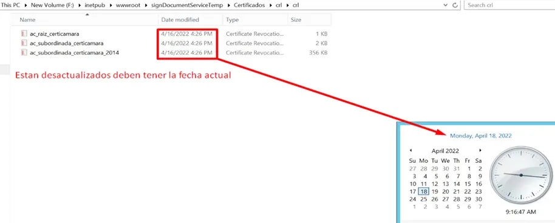
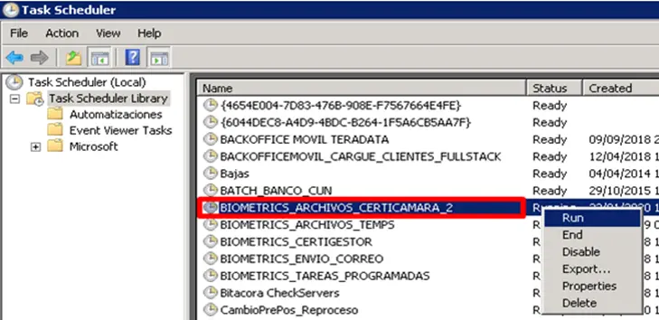
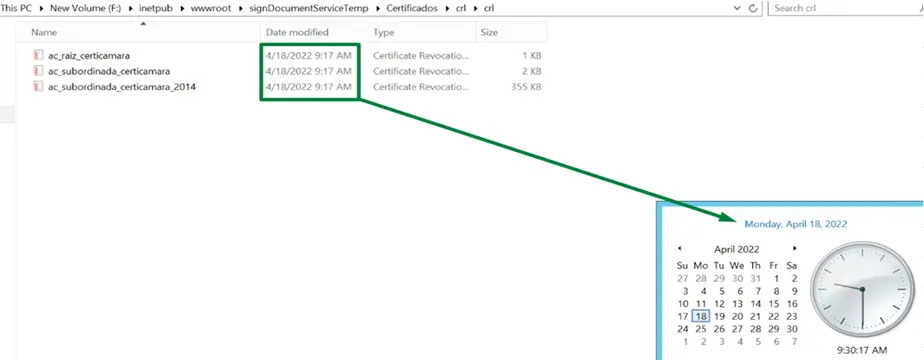
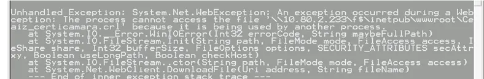
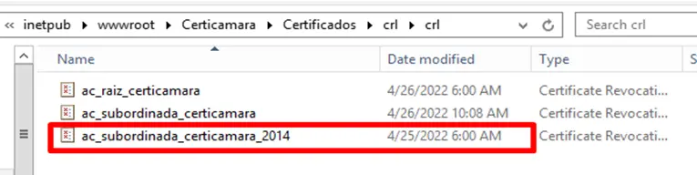

import { Aside } from '@astrojs/starlight/components';
import { Card } from '@astrojs/starlight/components';
import { Steps } from '@astrojs/starlight/components';
import { Tabs, TabItem } from '@astrojs/starlight/components';

### Error Certificados


<Tabs>
   <TabItem label="Rutas">
    <Steps>
      1. Revisar las siguientes rutas:
         <Aside> 
            ```js
            F:\inetpub\wwwroot\Certicamara\Certificados\crl\crl
            ```
            ```js
            F:\inetpub\wwwroot\BIOMETRICO2\Certificados\crl\crl
            ```
            ```js
            F:\inetpub\wwwroot\signDocumentServiceTemp\Certificados\crl\crl
            ```
         </Aside>
      
      2. Todos los certificados deben estar actualizados.
         <br />
         A continuación un ejemplo cuando están **desactualizados**:

         <div class="flex justify-center w-full">
            <div class="w-3/4 border">
              
            </div>
         </div>
      
      3. Si **NO** tienen la fecha actual se debe ingresar al servidor:

         <div class="flex justify-center w-full">
            <div class="w-3/4 border">
              
            </div>
         </div>

      4. Verificar que los certificados se actualicen:
      
         <div class="flex justify-center w-full">
            <div class="w-3/4 border">
              
            </div>
         </div>

      5. Puede que la tarea no actualice todos los archivos en ese caso se debe detener el pool del servicio que no se actualizo. 
         <br />
         Si el problema persiste pueden probar cambiando el archivo por uno ya generado en otra carpeta y volver a ejecutar la tarea en **Servnotifica**
         
         <div class="flex justify-center w-full">
            <div class="w-3/4 border">
              
            </div>
          </div>
          <br />
          <div class="flex justify-center w-full">
              <div class="w-3/4 border">
                
              </div>
          </div> 
    </Steps>
   </TabItem>
   <TabItem label="Credenciales">
    Credenciales y Servidor para validación de rutas:
      <Card>      
      - Servicio: **10.80.2.233**
      - Nombre de Usuario: **gmovistar**
      - Contraseña: **EvolTecn*21**
      </Card>

    Credenciales y Servidor para ejecución de la consola:
      <Card>      
      - Servicio: **10.80.135.56** (servnotifica)
      - Usuario: **gmovistar** 
      - Contraseña: **EvolTecn*21**      
      </Card>
   </TabItem>
</Tabs>


