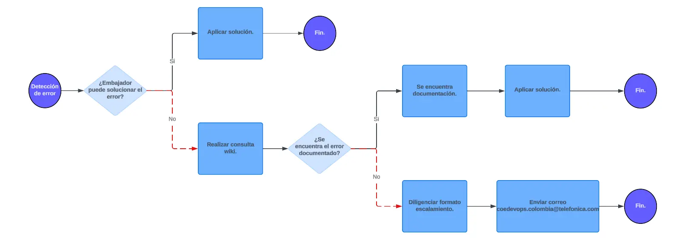

### **Alcance del Programa Embajador DevOps**

#### **Alcance:**
El programa capacita a uno o más miembros de una célula, según la capacidad asignada por el PO. Al finalizar, el embajador podrá automatizar despliegues en cualquier ambiente mediante pipelines y replicar el conocimiento para mejorar la autogestión de su célula.

#### **Contexto y Acuerdos:**
El embajador recibe formación de un padrino del equipo DevOps. Tras completar el temario, recibe una certificación que le otorga los permisos necesarios para gestionar y resolver situaciones relacionadas con el pipeline y el despliegue. Además, si el embajador deja su rol, debe transferir el conocimiento al equipo.

#### **Responsabilidades del Embajador:**
El embajador debe compartir el conocimiento recibido con su célula. Al término del programa, la célula podrá construir pipelines, automatizar despliegues en todas las etapas y gestionar soluciones tecnológicas integradas.

#### **Acuerdos de capacidad:**
La capacidad inicial la asigna el PO de DevOps, ajustándose al tiempo de formación, y se reduce al finalizar el temario. Para iniciar el programa, es necesario cumplir ciertos requisitos (DOR) y solicitar un especialista DevOps mediante la plataforma interna.

#### **Flujo de atención de errores:**
1. Detección del error.
2. El embajador intenta solucionarlo:
   - Si lo soluciona, fin.
   - Si no, consulta la wiki:
     - Si está documentado, aplica la solución.
     - Si no, escala el problema a la comunidad correspondiente.

  

    
  

#### **Situaciones gestionadas por la célula:**
- Problemas en compilación, Quality Gate, empaquetamiento, o Dockerfile.
- Administración de archivos de configuración.
- Análisis de logs.
- Configuraciones gestionadas por DevOps como Quality Gates, ramas, creación de proyectos, y gestión de usuarios.
