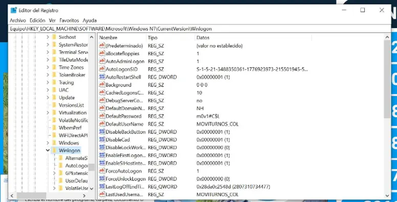
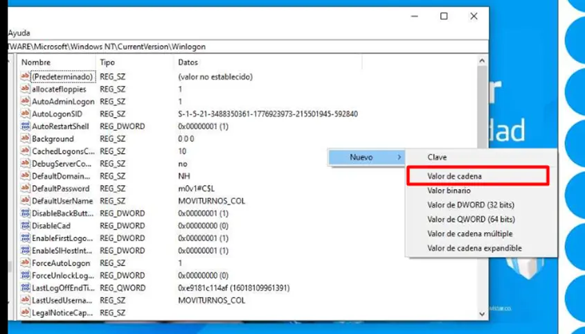
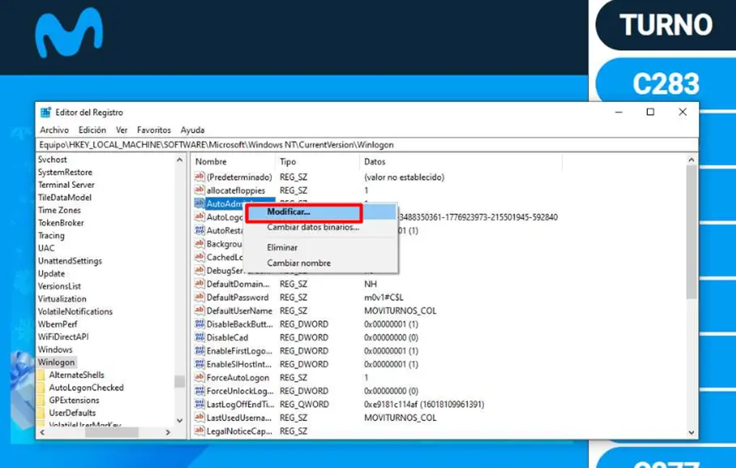
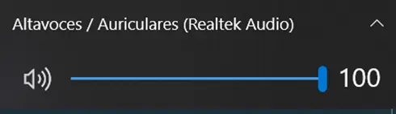
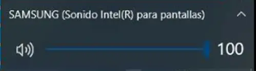
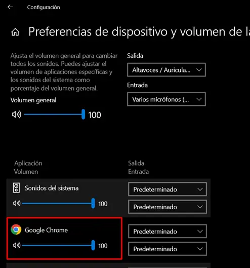
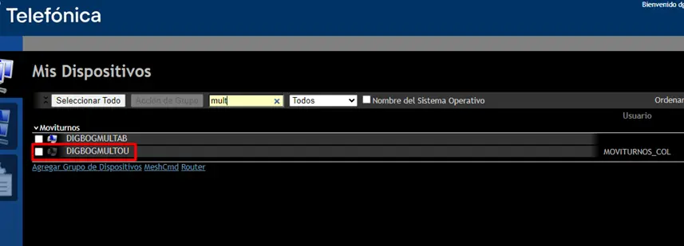

import { Aside, Card, FileTree, Steps } from '@astrojs/starlight/components';

### Enlaces

- Url TV: https://moviturnotv.telefonicawebsites.co/tv 
- Url Atril: https://moviturno.telefonicawebsites.co
- Url Gestión: https://moviturnogestion-ext.telefonicawebsites.co

### Atril o Tv sin inicio de sesión automático

<Steps>

1. Se debe ingresar a **Telefonica Meshcentral** 

   ```js
   https://meshcentral1.telefonicawebsites.co/login
   ```

2. Ingresar al equipo reportado lista de dispositivos: **Dispositivos Moviturnos.xlsx**

   ```js
   https://telefonicacorp.sharepoint.com/:x:/r/sites/Canales.TMHNH/_layouts/15/Doc.aspx?sourcedoc={159CAB37-BA23-4D17-93A8-AFD81B2D4DFE}&&file=Dispositivos Moviturnos.xlsx&&action=default&&mobileredirect=true
   ```

3. Tener en cuenta las Credenciales:
    <Card title="Credenciales">
    - Nombre de Usuario: **MOVITURNOS_COL**
    - Contraseña: **m0v1#C$L**
    </Card> 

4. Se debe buscar Regedit o Editor de registro y ejecutar como administrador:
    <div class="flex justify-center w-full">
      <div class="w-6/7">
      
      </div>
    </div>


5. Validar que en siguiente ruta se encuentren estos 5 parámetros configurados:

   ```js
   HKEY_LOCAL_MACHINE\SOFTWARE\Microsoft\Windows NT\CurrentVersion\Winlogon

   ```
   
   <Card title="Llaves">
   - DefaultUserName: **MOVITURNOS_COL**
   - DefaultPassword: **m0v1#C$L**
   - DefaultDomainName: **NH**
   - ForceAutoLogon: **1**
   - AutoAdminLogon: **1** 
   </Card>

    <div class="flex justify-center w-full">
      <div class="w-6/7">
      
      </div>
    </div>

6. Si no se encuentra alguno debe agregarse dando clic derecho Nuevo - Valor de cadena, colocamos el Nombre: 
    - DefaultUserName
    - DefaultPassword
    - DefaultDomainName
    - ForceAutoLogon
    - AutoAdminLogon

    <div class="flex justify-center w-full">
      <div class="w-6/7">
      
      </div>
    </div>

7. Damos clic sobre el campo recién creado y le damos modificar y colocamos el dato:
    <div class="flex justify-center w-full">
      <div class="w-6/7">
      
      </div>
    </div>

</Steps>

### Tv Centro de experiencia sin sonido 

<Steps>
1. Se debe validar que el dispositivo tenga el 100 de volumen de los altavoces

    <div class="flex justify-center w-full">
      <div class="w-6/7">
      
      </div>
    </div>

   <Aside type="caution" title="Tener en cuenta">
     En algunos casos el sonido va por el mismo TV puede aparecer la marca del equipo 
   </Aside>

    <div class="flex justify-center w-full">
      <div class="w-6/7">
      
      </div>
    </div>

2. Si esta al 100 validar que tambien lo esté en:

   <FileTree>
    - `Configuración`
      - `Sonido` 
        - `Opciones avanzadas de Sonido` 
          - `Preferencias de dispositivo y volumen de la aplicación`
    </FileTree>

    <div class="flex justify-center w-full">
      <div class="w-6/7">
      
      </div>
    </div>
 
3. Si todos los parametros se encuentran bien, se debe limpiar cache y borrar cookies del navegador. 
4. Cerrar y volver a ingresar al navegador colocar la Url de TV:

   ```js
   https://moviturnotv.telefonicawebsites.co/tv 
   ```
5. Solicitar al cordinador del CE o a la persona que reporto la incidencia que agregue el dispositivo.

</Steps>

### Dispositivo no encontrado en el Meshcentral

    <div class="flex justify-center w-full">
      <div class="w-6/7">
      
      </div>
    </div>

Si solicitan algún requerimiento con un dispositivo y no se encuentra activo el dispositivo

<Steps>
1. Se debe solicitar al usuario reiniciar el dispositivos.
2. Si después de reiniciar el dispositivo no se puede visualizar, se debe confirmar que el dispositivo que el equipo si tenga internet.
3. Si el dispositivo tiene internet entonces se debe solicitar ayuda a **Carolina Taborda** para reinstalar el mesh en el equipo ya que no lo podemos visualizar como activo.

    ```js
    carolina.taborda@telefonica.com
    ```
</Steps>