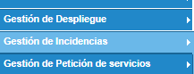

import { Aside } from '@astrojs/starlight/components'; 
import { Steps } from '@astrojs/starlight/components'; 

<Aside  type="tip" title="Sugerencia"> 
  - Hacerlo al final del día.
  - Tener en cuenta que algunos usuarios solo ponen el requerimiento y ni avisan que les falla algo.
</Aside> 

### Cierre de Incidencias

<Steps>
1. ##### Iniciar Sesión en Remedy
    
- Solicitar las Credenciales con el equipo

    
2. ##### Buscar las Incidencias
    - Aplicaciones
    

      

        
      

    
  
    
    - Gestión de Incidencias
    

      

        
      

    

    - Consola de Incidencias
    

      

        
      

    
 

3. ##### Filtrar
    - Mostrar -> Asignado a todos mis grupos    
    - Filtrar por -> Todas abiertas > Todas las prioridades
    

      

        
      

    
 
    

      

        
      

    
 

4. ##### Buscar y Gestionar
    - Se copia el REQ y se busca en los chats o en los correos con información (Sugerencia)
    - Se da doble clic en la incidencia para abrirla
    

      

        
      

    
 
    - Si se desea ver la descripción del caso se da clic en notas (Sugerencia)
    

      

        
      

    
 
    - Se se desea ver el(los) adjunto(s) del caso, se deve validar si hay. El número aquí indica que hay 1.
    

      

        
      

    
 
    - Para verlo, se debe descargar con este botón.
    

      

        
      

    
  
    - Para cerrar el REQ, debe diligenciar los campos: 
        - **Usuario asignado**: Cualquier integrante del equipo
        - **Estado**: Resulto
        - **Motivo del estado**: Solucionado con Optimización
        - **Resolución**: Lo que se hizo.  Puede escribir lo que quiera -> Al lado hay un botón (verde) para hacer grande el TextArea
    

      

        
      

    
 
    - Para guardar la resolución y que cambie el estado, se le da clic al botón guardar
    

      

        
      

    
 
    - El guardar cambia el estado   
     

      

         
      

    
 
     

      

         
      

    
  

5. ##### Deben gestionarse TODOS los REQ
    

      

        
      

    
  

6. Fin
</Steps>

