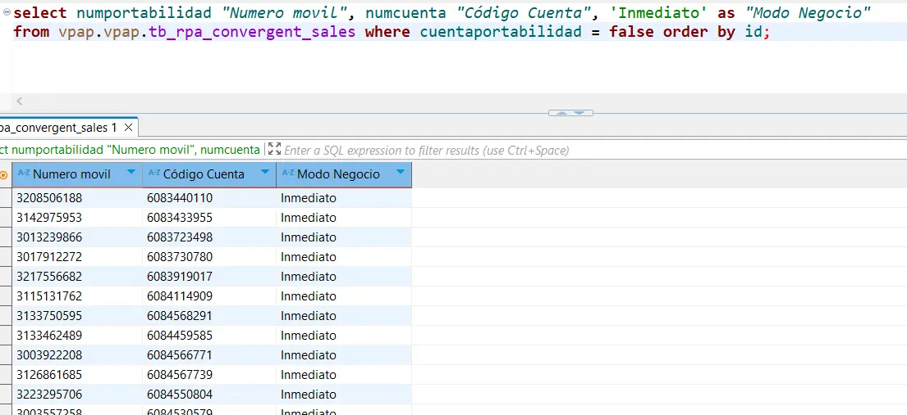
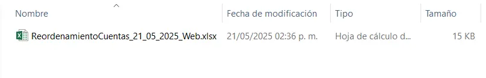
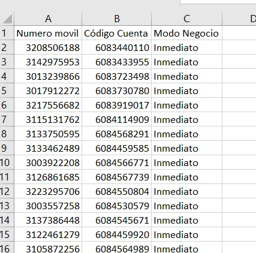

import { Aside } from '@astrojs/starlight/components';
import { Card } from '@astrojs/starlight/components';
import { Steps } from '@astrojs/starlight/components';
import { Tabs, TabItem } from '@astrojs/starlight/components';

### Reordenamiento

<Aside>
  Tarea diaria<br />
  **Hora de ejecucion: 16:30**
</Aside>

<Tabs>
   <TabItem label="Proceso">
    <Steps>
    1. Ingresar al servidor de base de datos
    2. Ejecutar la siguiente Query:
       ```sql
       SELECT numcuenta, numportabilidad from vpap.vpap.tb_rpa_convergent_sales where cuentaportabilidad = false order by id;
       ```
       <div class="flex justify-center w-full">
          <div class="w-3/4 border">
            
          </div>
       </div>

    3. Copiar los registros en un Excel nuevo
       <Aside type="caution">
       Se debe renombrar con la fecha actual, en el formato establecido. Para los primeros dias del mes, se debe anteponer el numero 0. 
       <br />
       Ejemplo: **Reordenamiento 01_12-2024**
       </Aside>
       <div class="flex justify-center w-full">
          <div class="w-3/4 border">
            
          </div>
       </div>
       <br />
       <div class="flex justify-center w-full">
          <div class="w-3/4 border">
            
          </div>
       </div>
    
    4. Ingresar al servidor **Servnotifica**
    5. Ingresar a la ruta: 
       ```js
       \\srvfraude\servcliente\ESI_BO\REPORTE\DirectorioReportes\Procesos_Batch_BackOffice\Oferta Navidad\
       ```
    6. Dejar el Excel en la ruta
    </Steps>
   </TabItem>
   <TabItem label="Credenciales">
    Credenciales y Servidor para ejecutar el query:
      <Card>
      - Host: **aprodventaspapdb.postgres.database.azure.com**
      - Port: **5432**
      - Database: **vpap**
      - Username: **app-ventasPaP**
      - Password: **8wAuho@CtgZO** 
      </Card>

    Credenciales y Servidor para ejecución de la consola:
      <Card>      
      - Servicio: **10.80.135.56** (Servnotifica)
      - Usuario: **gmovistar** 
      - Contraseña: **EvolTecn*21**      
      </Card>
   </TabItem>
</Tabs>

   
